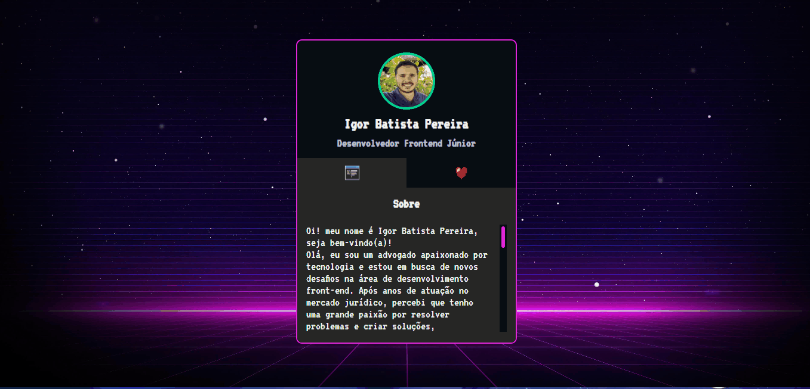

# projeto-mini-portifolio
Um projeto de HTML, CSS3 e JavaScript, com o intuito de demonstrar meus conhecimentos adquiridos até o momento no @Devemdobro com o curso DevQuest de formação Fullstack com mentoria, criando um mini portfólio, com minhas redes profissionais e um pouco sobre mim. 🚀

## Tecnologias utilizadas

- HTML
- CSS
- JavaScript

---

### Coisas que **aprendi**:

1. a trabalhar com o JavaScript escondendo as abas, mostrando o conteudo que foi selecionado.

---

### **Dificuldades** enfrentadas

- esconder as abas selecionadas com o JavaScript.

---

### Autor

- Execução do projeto - [Igor Batista](https://github.com/igor-batista-pereira)